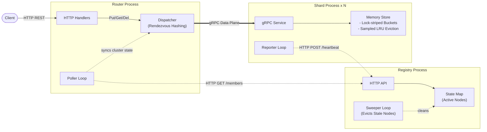

# rkv

A shared-nothing, sharded key-value store in Go with a rendezvous hashing HTTP router, autonomous gRPC storage nodes, sampled LRU eviction and dynamic cluster membership tracking

## Overview

`rkv` exposes a simple put/get/delete/exists API over HTTP. Keys are hashed and routed to one of the several shard member, each with its own independent in-memory store with no shared state and no communication between members. Members register themselves with a registry service on startup and send periodic heartbeats, the router polls the registry to keep itself updated on current shard view and routes each request to the correct member. If a member dies, its heartbeats stops, the registry evicts it and router routes around it

## Architecture



- **registry:** track alive shards via heartbeats, sweep out dead ones and give router a member list on request
- **router:** client facing HTTP server. polls registry for membership then dispatch each key to the right shard over gRPC using **rendezvous hashing**
- **shard:** holds a slice of data. each shard runs a lock-striped in-memory store with sampled-LRU eviction and reports own address to registry

## Design Notes

- **shared-nothing over coordinated cluster:** shards don't replicate, gossip or know about each other in any way. the only thing that make them behave as one system is the router's routing decision

- **rendezvous hashing:** HRW hashing gives correct, deterministic ownership without a complexity of virtual nodes or ring maintenance

- **tag-based conditional polling:** registry keeps a monotonic version tag on every membership change. the router sends its last-seen tag and gets a `304` if nothing changed

- **lock stripping:** splitting the store into `256` independently-locked buckets remove a single point of contention under concurrent writes

- **sampled LRU:** go map iteration order is randomized which make a small random sample a good fit for approximate LRU

- **boot barrier on router:** the router doens't start server until it gets a first successfuul membership from registry so it never starts routing into a void

## Current State and Limitations

**implemented**
- shard registration, heartbeats and stale-member sweeping
- router membership polling with tag-based conditional fetching
- rendezvous hashing for key -> shard routing
- lock-striped store (256 buckets) with per-bucket sampled-LRU eviction
- put/get/delete/exists/info over gRPC, exposed via HTTP on the router
- graceful shutdown across all three services (signal-based, drains + notifies registry on shard exit)

**where it breaks**
- no replication, losing a shard loses its data permanently
- no data migration on membership change
- no persistence
- eviction is per-bucket so a hot bucket can evict while store is under budget

## Running

each service reads its config from environment variables with local defaults

| Service  | Variable       | Default                        |
| -------- | -------------- | ------------------------------ |
| registry | `PORT`         | `8010`                         |
| router   | `PORT`         | `8081`                         |
| router   | `REGISTRY_URL` | `localhost:8010`               |
| shard    | `PORT`         | `8080`                         |
| shard    | `REGISTRY_URL` | `localhost:8010`               |
| shard    | `SHARD_ADDR`   | derived from hostname if unset |

to run full cluster locally

```bash
docker compose up -d --build
```

this starts one regsitry, one router and two shards (scale shards via `docker compose up --scale member=N`)

## Endpoints

**router (HTTP, client-facing)**
| Method   | Path            | Purpose                                 |
| -------- | --------------- | --------------------------------------- |
| `PUT`    | `/put/{key}`    | Store a value (`{"value": "..."}` body) |
| `GET`    | `/get/{key}`    | Fetch a value                           |
| `DELETE` | `/delete/{key}` | Remove a key                            |
| `HEAD`   | `/key/{key}`    | Check existence                         |
| `GET`    | `/info`         | List currently known shard addresses    |
| `GET`    | `/ping`         | Liveness check                          |

**registry (HTTP, internal)**
| Method | Path         | Purpose                                                    |
| ------ | ------------ | ---------------------------------------------------------- |
| `POST` | `/heartbeat` | Shard reports itself alive                                 |
| `POST` | `/leave`     | Shard reports graceful shutdown                            |
| `GET`  | `/members`   | Current member list (supports `x-tag` conditional polling) |

## Project Structure

```
.
├── cmd
│   ├── registry
│   ├── router
│   └── shard
├── internal
│   ├── config
│   │   ├── env.go            # env var lookup helper with fallback
│   │   ├── registry.go       # registry service config
│   │   ├── router.go         # router service config
│   │   └── shard.go          # shard service config, derives SHARD_ADDR from hostname
│   ├── constants
│   │   └── consts.go         # tunables: intervals, bucket count, size limits, timeouts
│   ├── dispatcher
│   │   ├── client.go         # gRPC calls to shards (put/get/delete/exists/info)
│   │   ├── dispatcher.go     # tracks live shard connections, reconciles membership diffs
│   │   └── hashing.go        # rendezvous hashing: picks the shard for a given key
│   ├── handler
│   │   ├── errors.go         # gRPC status -> HTTP status mapping, validation
│   │   ├── handler.go        # router's HTTP handlers (put/get/delete/exists/info/ping)
│   │   └── models.go         # request/response JSON shapes
│   ├── interceptor
│   │   └── logging.go        # gRPC unary interceptor, logs method/key/duration/result
│   ├── middleware
│   │   └── logger.go         # HTTP middleware, logs status/duration/method/path
│   ├── registry
│   │   ├── payload.go        # shared request/response shapes for registry API
│   │   ├── poller
│   │   │   └── poller.go     # router-side: polls registry for members, boot barrier
│   │   ├── reporter
│   │   │   └── reporter.go   # shard-side: sends heartbeats, reports on leave
│   │   └── server
│   │       ├── handler.go    # registry HTTP handlers (heartbeat/members/leave)
│   │       └── state.go      # registry in-memory state + stale-member sweeper
│   ├── service
│   │   ├── service.go        # gRPC ShardService implementation, wraps the store
│   │   └── validate.go       # key/value size validation
│   └── store
│       ├── eviction.go       # sampled-LRU eviction per bucket
│       ├── ops.go            # put/get/delete/exists on a bucket
│       └── store.go          # bucket struct, hashing keys to buckets
├── proto
│   └── shard.proto           # ShardService definition: put/get/exists/delete/info
├── README.md
├── docker-compose.yml
├── Dockerfile
├── go.mod
├── go.sum
└── scripts
    └── gen_proto.sh            # runs protoc, outputs generated go code to gen/
```
